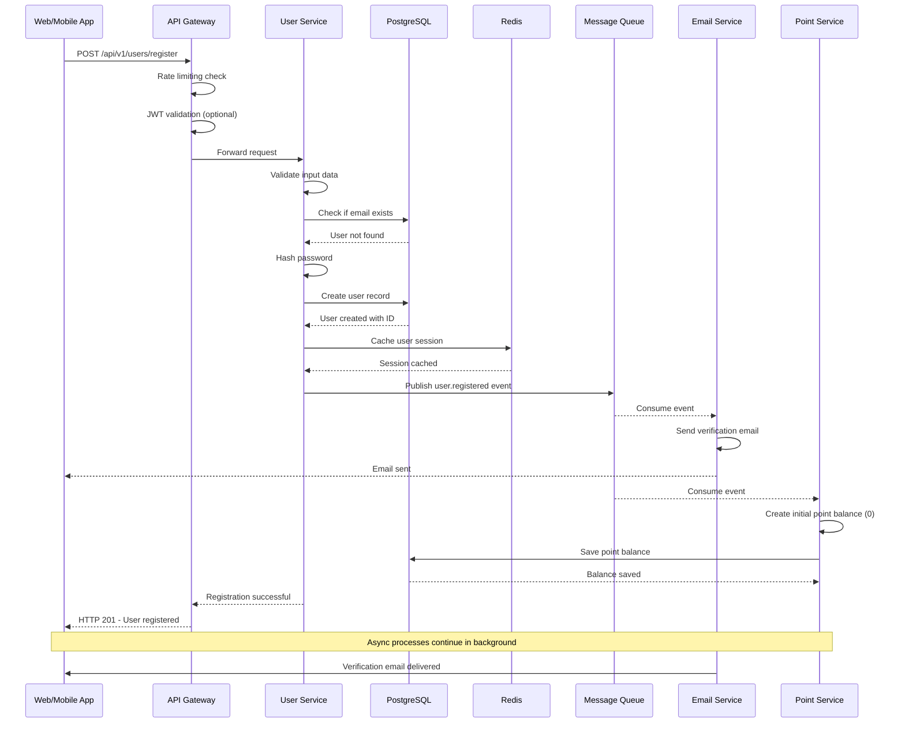
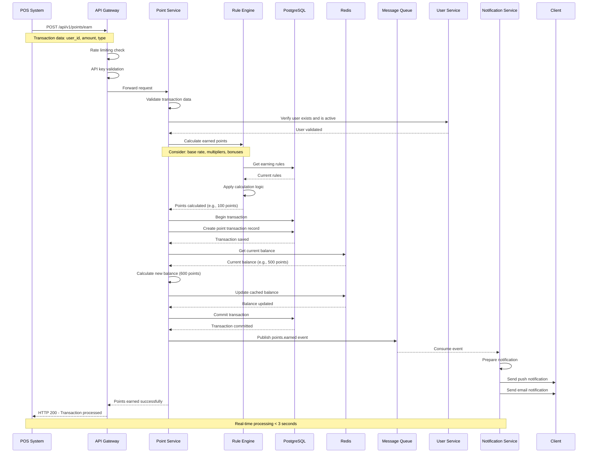
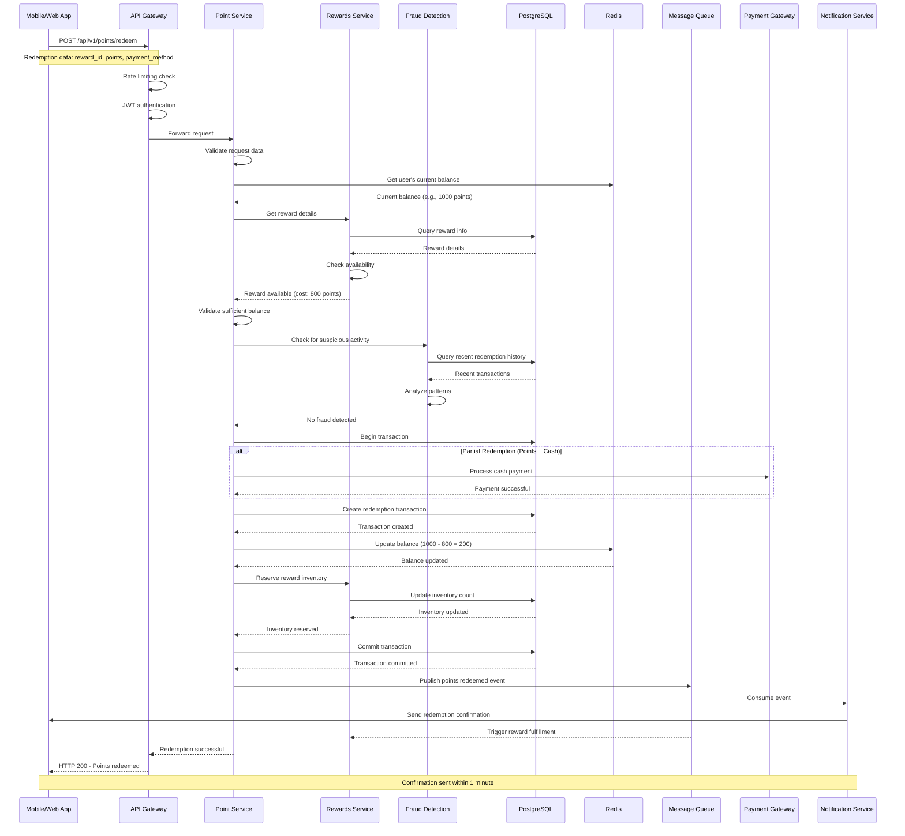
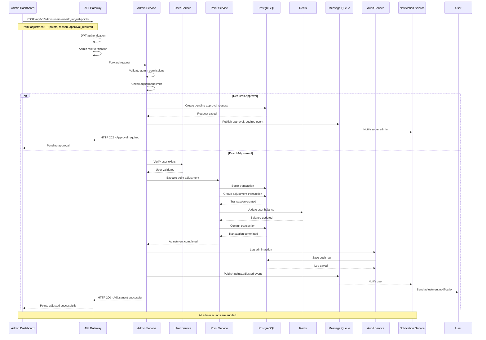
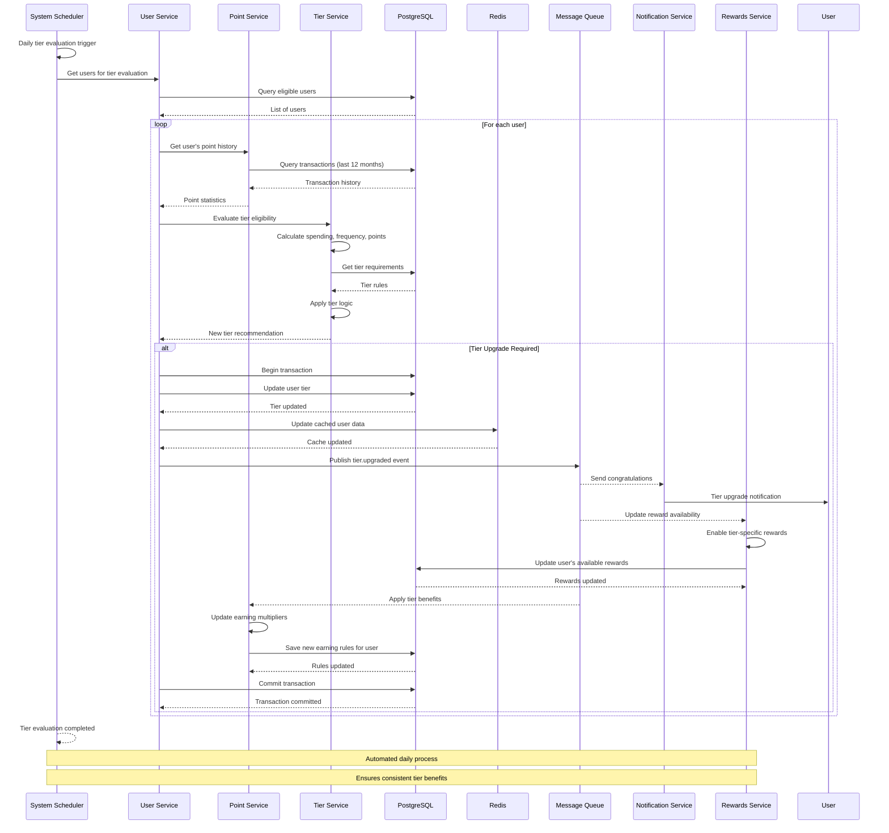
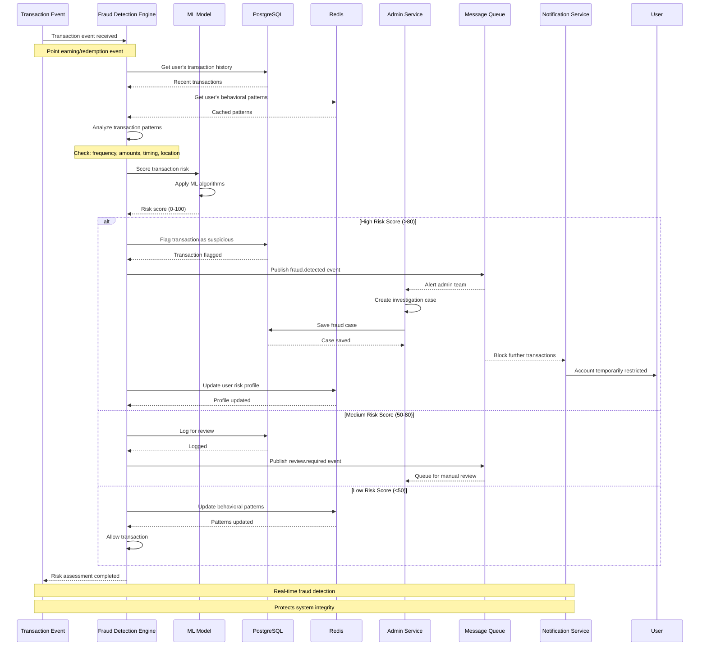
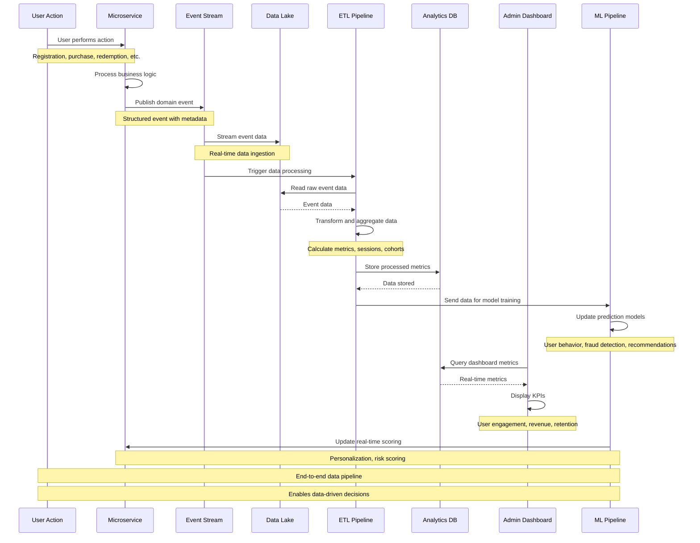
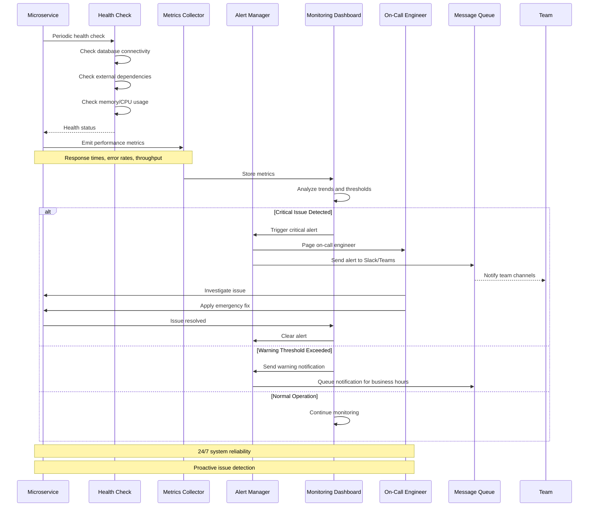

# Sequence Diagrams - Critical Business Flows

**Purpose:** Visual documentation of key business logic flows for developer implementation  
**Format:** Mermaid sequence diagrams  
**Usage:** Reference during development and code review  

---

## 1. User Registration Flow

---

## 2. Point Earning Flow

---

## 3. Point Redemption Flow

---

## 4. Admin User Management Flow

---

## 5. Tier Upgrade Flow

---

## 6. Fraud Detection Flow

---

## 7. Analytics Data Collection Flow

---

## 8. System Health Monitoring Flow

---

## Usage Guidelines for Developers

### 1. Understanding the Diagrams
- **Participants:** Represent system components, services, or actors
- **Messages:** Show the flow of data and control between components
- **Notes:** Provide additional context and business rules
- **Alt blocks:** Show conditional logic and different paths

### 2. Implementation Reference
- Use these diagrams during development to understand the complete flow
- Ensure all steps are implemented according to the sequence
- Pay attention to error handling and alternative flows
- Consider the timing and performance requirements noted

### 3. Code Review Guide
- Verify that implemented code follows the documented sequence
- Check that all events are published and consumed as shown
- Ensure error handling covers the scenarios depicted
- Validate that the performance requirements are met

### 4. Testing Strategy
- Create test cases that cover the main flow and alternative paths
- Use the diagrams to identify integration test scenarios
- Ensure that all external dependencies are properly mocked
- Test the error conditions and edge cases shown

---

**Next Steps:**
1. Study the relevant diagrams before implementing features
2. Keep these diagrams updated as the system evolves
3. Use them during code reviews and system design discussions
4. Reference them when troubleshooting production issues